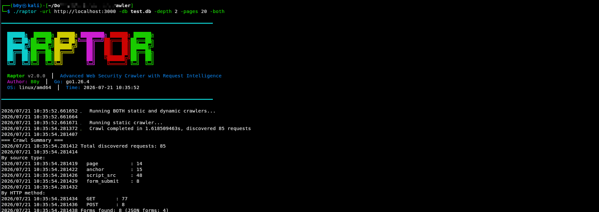

# 🦅 Raptor Web Crawler - Advanced Security Testing Framework

  
  
  
  
  
  
  

 

  

 

> **Advanced Web Security Crawler with Request Intelligence**  
> Discover endpoints, forms, API routes, hidden attack surfaces, and automatically generate scanner-ready artifacts for modern web applications.

---

## 📋 Table of Contents

- [🔥 Features](#-features)
- [📊 Architecture](#-architecture)
- [🚀 Quick Install](#-quick-install)
- [📖 Usage](#-usage)
- [🎯 Scanner Integration](#-scanner-integration)
- [📊 Results](#-results)
- [🔧 Configuration](#-configuration)
- [🤝 Contributing](#-contributing)
- [📄 License](#-license)

---

## 🔥 Features

### 🎯 Core Capabilities

| Feature | Description |
|---------|-------------|
| **Static & Dynamic Crawling** | Fast static crawling + headless browser for SPAs |
| **Katana Integration** | 100% Katana pre-pass for fast breadth-first discovery |
| **Form Discovery** | Automatically detect and extract all forms with parameters |
| **JSON Support** | Capture JSON payloads from modern SPAs with schema inference |
| **SPA Detection** | Discover React, Vue, Angular, and Next.js routes |
| **AJAX/Fetch Detection** | Capture XHR, fetch, axios, GraphQL, and WebSocket requests |
| **Request Templates** | Generate reusable request templates with JSON schemas |
| **SQLite Storage** | All results saved to SQLite database |
| **Beautiful CLI** | Colored output with professional banner |
| **Both Modes** | Run static and dynamic in one command |

### 🔐 Security Testing Features

| Feature | Description |
|---------|-------------|
| **Full Headers Capture** | Authorization, Cookies, CSRF, XSRF, Origin, Referer |
| **Cookie Analysis** | HttpOnly, Secure, SameSite attributes |
| **Response Fingerprinting** | Status, Length, Hash, Mime, Title |
| **API Schema Inference** | Auto-generate OpenAPI/Swagger specs |
| **GraphQL Detection** | Detect and extract GraphQL queries and mutations |
| **WebSocket Detection** | Capture ws:// and wss:// endpoints |
| **Route Parameter Extraction** | `/users/123` → `/users/{id}` |
| **JS Endpoint Mining** | Extract fetch(), axios(), GraphQL from JavaScript |
| **Secret Detection** | API keys, JWT tokens, AWS keys from JS |
| **Multipart Upload Detection** | File upload forms with test files |

### 📤 Scanner Integration

| Integration | Purpose |
|-------------|---------|
| **SQLMap** | Export discovered endpoints for SQL injection testing |
| **Dalfox** | Export URLs for XSS vulnerability scanning |
| **Nuclei** | Generate custom Nuclei templates |
| **OpenAPI** | Generate OpenAPI/Swagger specifications |
| **Postman** | Export collections for API testing |
| **Burp Suite** | Request files for manual testing |

---

## 📊 Architecture

Option 2: Clone & Build
bash
git clone https://github.com/Anduamlk/web-Crawler.git
cd web-Crawler
go mod download
go build -o raptor ./cmd/crawler
Option 3: Docker
bash
docker build -t raptor-crawler .
docker run -v $(pwd):/data raptor-crawler -url http://target.com -db /data/results.db -both
📖 Usage
Basic Commands
bash
# Static crawling only
raptor -url http://localhost:3000 -db results.db -depth 3 -pages 100

# Dynamic crawling only (for SPAs)
raptor -url http://localhost:3000 -db results.db -depth 3 -pages 100 -dynamic

# Both static AND dynamic (Best for full coverage)
raptor -url http://localhost:3000 -db results.db -depth 3 -pages 100 -both

# With Katana pre-pass (Fast discovery + Deep intelligence)
raptor -url http://localhost:3000 -db results.db -depth 3 -pages 50 -both -katana -katana-depth 3

# With JSON output
raptor -url http://localhost:3000 -db results.db -depth 3 -pages 100 -both -output results.json

# With session (authenticated crawling)
raptor -url http://localhost:3000 -db results.db -session session.json -both

# Stay in domain (prevent cross-domain crawling)
raptor -url http://localhost:3000 -db results.db -depth 3 -pages 50 -both -stay-in-domain
Advanced Options
bash
# Full hybrid mode with all options
raptor -url https://target.com \
    -db results.db \
    -depth 3 \
    -pages 100 \
    -both \
    -katana \
    -katana-depth 3 \
    -katana-concurrency 20 \
    -stay-in-domain \
    -output scan_results.json \
    -session session.json \
    -proxy http://127.0.0.1:8080 \
    -timeout 60s
🎯 Scanner Integration
Export for SQLMap (SQL Injection Testing)
bash
# Extract all parameterized URLs
sqlite3 results.db "SELECT url FROM discovered_requests WHERE method='GET' AND url LIKE '%?%';" > sqlmap_urls.txt

# Run SQLMap
sqlmap -m sqlmap_urls.txt --batch --level=2 --risk=2 --dbms=postgresql
Export for Dalfox (XSS Testing)
bash
# Extract all URLs
sqlite3 results.db "SELECT url FROM discovered_requests WHERE method='GET';" > dalfox_urls.txt

# Run Dalfox
dalfox file dalfox_urls.txt --output xss_results.txt --only-poc
Export POST Requests with Bodies
bash
# Export POST requests for SQLMap
sqlite3 results.db "SELECT url, body FROM discovered_requests WHERE method='POST' AND body != '';" > post_requests.txt

# Create SQLMap request files
sqlite3 results.db -csv -header "SELECT url, body FROM discovered_requests WHERE method='POST' AND body != '';" > post_requests.csv
Generate OpenAPI Specification
bash
# Export to OpenAPI format
raptor -url https://api.target.com -db results.db -both -output openapi.json

# Or convert existing results
python3 scripts/export_openapi.py results.db > openapi.yaml
📊 Results
Database Schema
sql
-- Discovered requests with full metadata
CREATE TABLE discovered_requests (
    id TEXT PRIMARY KEY,
    url TEXT NOT NULL,
    method TEXT NOT NULL,
    headers TEXT,      -- JSON
    body TEXT,
    source_type TEXT,
    depth INTEGER,
    normalized_url TEXT,
    created_at TIMESTAMP,
    form_fields TEXT,  -- JSON
    form TEXT,         -- JSON
    spa_route TEXT,    -- JSON
    parameters TEXT,   -- JSON
    cookies TEXT,      -- JSON
    response TEXT,     -- JSON
    body_type TEXT,
    json_format TEXT   -- JSON
);
Query Examples
bash
# Count by source type
sqlite3 results.db "SELECT source_type, COUNT(*) FROM discovered_requests GROUP BY source_type;"

# Find all forms
sqlite3 results.db "SELECT url, json_extract(form, '$.form_type') as form_type FROM discovered_requests WHERE form IS NOT NULL;"

# Find POST requests with bodies
sqlite3 results.db "SELECT url, body FROM discovered_requests WHERE method='POST' AND body != '';"

# Find JSON APIs
sqlite3 results.db "SELECT url, method, json_extract(json_format, '$.payload') as payload FROM discovered_requests WHERE json_format IS NOT NULL;"

# Find GraphQL endpoints
sqlite3 results.db "SELECT url FROM discovered_requests WHERE url LIKE '%graphql%' OR body LIKE '%query%';"
